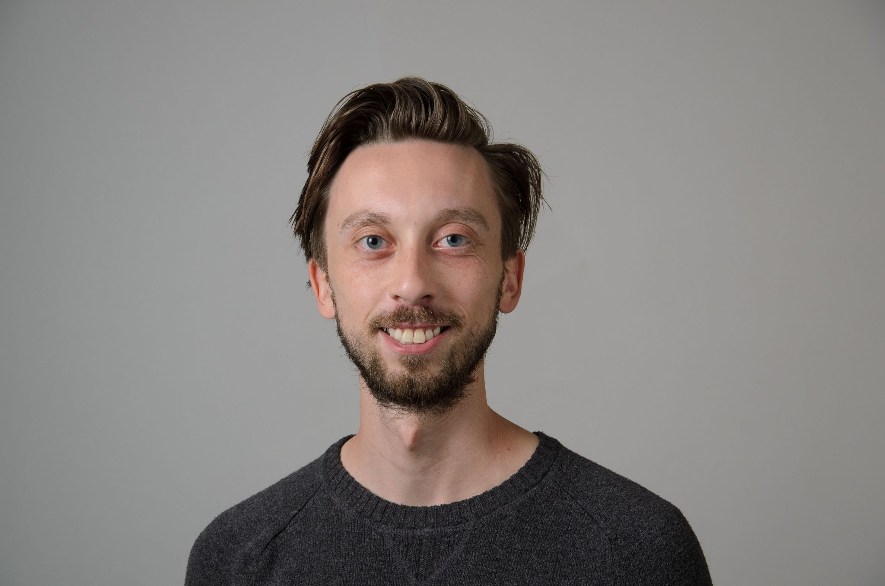

      

I'm a Ph.D. student at the University of Connecticut, working under the supervision of [Vasilis Chousionis](https://www2.math.uconn.edu/~chousionis/). I study harmonic analysis and geometric measure theory in the context of sub-Riemannian geometry. The problems I am most interested in revolve around the theory of removable sets in Carnot groups. As a result, I like anything involving singular integrals such as notions of capacity, boundedness of Carnot Riesz transforms, and rectifiability in Carnot groups. [Here](CV-3.pdf) is my CV.

My parents have two very cute dogs, George and Archie. When I do math, I regularly feel like George. He's on the right.

      

